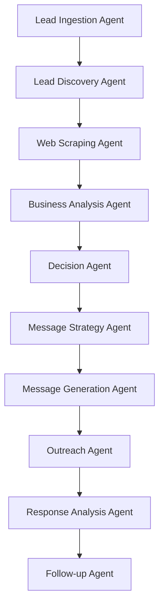

<div align="center">

# 🎯 AI Lead Outreach Agent

### *Autonomous AI-Powered Lead Generation & Outreach SaaS Platform*

[](https://www.python.org/)
[](https://reactjs.org/)
[](https://flask.palletsprojects.com/)
[](https://www.mysql.com/)
[](LICENSE)

*Transform your lead generation with intelligent automation powered by cutting-edge AI*

[Features](#-key-features) • [Demo](#-quick-start) • [Installation](#-installation) • [Documentation](#-api-documentation) • [Architecture](#-architecture)

</div>

---

## 📖 Overview

**AI Lead Outreach Agent** is a sophisticated, enterprise-grade SaaS platform that revolutionizes B2B lead generation and outreach. By combining advanced web scraping, AI-powered analysis, and autonomous decision-making, it eliminates manual prospecting and enables hyper-personalized outreach at scale.

### 🎯 Why Choose AI Lead Outreach? 

- **🤖 Fully Autonomous**: Set it and forget it - the AI agents work 24/7 to find, analyze, and engage leads
- **🧠 AI-Powered Intelligence**: Leverages Google Gemini & Groq LLaMA-3 for deep business analysis
- **🌐 Advanced Scraping**: Playwright-based scraping handles JavaScript-heavy modern websites
- **💬 Thanglish Outreach**: Unique Tamil-English hybrid messaging for culturally resonant communication
- **📊 Real-Time Analytics**:  Comprehensive dashboard with actionable insights and KPIs
- **✉️ Production-Ready**:  SMTP integration for actual email delivery, not just simulations

---

## ✨ Key Features

### 🔍 **Intelligent Lead Discovery**
- **AI Web Search**: Automated lead discovery using DuckDuckGo with industry and location targeting
- **Smart Scraping**: Extracts contact information from JavaScript-rendered websites using Playwright
- **Bulk Import**: CSV/Excel upload with automatic data validation and deduplication

### 🧬 **AI-Powered Analysis**
- **Business Trust Scoring**: Gemini 1.5 Flash analyzes company credibility and maturity
- **Sentiment Analysis**: Evaluates website content for business quality indicators
- **Intelligent Prioritization**: Automatically ranks leads based on conversion probability

### 🚀 **Autonomous Outreach**
- **Autopilot Mode**: Background scheduler processes leads without manual intervention
- **Personalized Messaging**: Groq-powered LLaMA-3 generates contextually relevant Thanglish messages
- **Multi-Channel Ready**: Email integration with extensible architecture for WhatsApp, LinkedIn, etc. 
- **Smart Follow-ups**: Automated follow-up sequences based on response analysis

### 📊 **Comprehensive Dashboard**
- **Real-Time KPIs**: Track leads, conversions, and outreach performance
- **Lead Pipeline**: Visual representation of lead status and progression
- **Activity Logs**: Detailed audit trail of all AI actions and decisions
- **Autopilot Control**: Toggle autonomous mode with a single click

---

## 🏗 Architecture

### **Tech Stack**

#### **Backend**
```
🐍 Python 3.8+ | Flask | MySQL
🤖 Google Gemini 1.5 Flash | Groq (LLaMA-3)
🌐 Playwright | BeautifulSoup | DuckDuckGo Search API
📧 SMTP | APScheduler
```

#### **Frontend**
```
⚛️ React 18 | Vite | React Router
🎨 Tailwind CSS | Heroicons
📡 Axios | RESTful API
```

### **AI Agent Ecosystem**



| Agent | Responsibility | AI Model |
|-------|---------------|----------|
| **Lead Ingestion** | Parse & validate CSV/Excel data | Rule-based |
| **Lead Discovery** | Search web for potential leads | DuckDuckGo API |
| **Web Scraping** | Extract contact info from websites | Playwright |
| **Business Analysis** | Assess company trustworthiness | Gemini 1.5 Flash |
| **Decision** | Prioritize outreach decisions | Gemini 1.5 Flash |
| **Message Strategy** | Plan communication approach | Gemini 1.5 Flash |
| **Message Generation** | Create personalized Thanglish messages | Groq LLaMA-3 |
| **Outreach** | Send emails via SMTP | SMTP Protocol |
| **Response Analysis** | Analyze incoming replies | Gemini 1.5 Flash |
| **Follow-up** | Manage automated sequences | APScheduler |

---

## 🚀 Quick Start

### Prerequisites

Ensure you have the following installed: 

- **Python** 3.8 or higher
- **Node.js** 16+ and npm
- **MySQL** 8.0+ (XAMPP/WAMP/native)
- **API Keys**: [Google Gemini](https://ai.google.dev/) & [Groq](https://console.groq.com/)

---

## 📦 Installation

### **1️⃣ Clone the Repository**

```bash
git clone https://github.com/mogesh-developer/ai_lead.git
cd ai_lead/ai-lead-outreach
```

### **2️⃣ Backend Setup**

```bash
cd backend

# Create virtual environment
python -m venv venv
source venv/bin/activate  # On Windows: venv\Scripts\activate

# Install dependencies
pip install -r requirements.txt

# Install Playwright browsers (critical for scraping)
python -m playwright install
```

### **3️⃣ Environment Configuration**

Create a `.env` file in the `backend/` directory:

```env
# Database Configuration
DB_HOST=localhost
DB_USER=root
DB_PASSWORD=your_mysql_password
DB_NAME=ai_lead_outreach

# AI API Keys
GEMINI_API_KEY=your_gemini_api_key_here
GROQ_API_KEY=your_groq_api_key_here

# SMTP Configuration (for email sending)
SMTP_EMAIL=your_email@gmail.com
SMTP_PASSWORD=your_app_specific_password
SMTP_SERVER=smtp.gmail.com
SMTP_PORT=587

# Application Settings
FLASK_ENV=development
SECRET_KEY=your_secret_key_here
```

> **⚠️ Important**: For Gmail, use [App Passwords](https://support.google.com/accounts/answer/185833?hl=en) instead of your regular password.

### **4️⃣ Database Setup**

```bash
# Start MySQL server (if using XAMPP, start from control panel)

# Create database (via MySQL CLI or phpMyAdmin)
mysql -u root -p
CREATE DATABASE ai_lead_outreach;
EXIT;
```

The application will auto-create tables on first run. 

### **5️⃣ Start Backend Server**

```bash
python app.py
```

✅ Backend running at `http://localhost:5000`

### **6️⃣ Frontend Setup**

Open a new terminal: 

```bash
cd ai-lead-outreach/frontend

# Install dependencies
npm install

# Start development server
npm run dev
```

✅ Frontend running at `http://localhost:5173`

---

## 🎮 Usage Guide

### **Method 1: Manual Lead Upload**

1. Navigate to **Upload Leads** page
2. Upload CSV/Excel with columns: `name`, `email`, `phone`, `company`, `location`
3. System validates and imports leads automatically

**Sample CSV Format:**
```csv
name,email,phone,company,location
John Doe,john@example.com,+91-9876543210,Acme Corp,Mumbai
Jane Smith,jane@example. com,+91-9123456789,TechStart,Bangalore
```

### **Method 2: AI Lead Discovery**

1. Go to **Find Leads** → **AI Discovery**
2. Enter:
   - **Industry**:  "Software Development Companies"
   - **Location**: "Bangalore, India"
3. Click **Discover Leads**
4. AI searches the web, visits websites, and extracts contacts automatically

### **Method 3: Direct URL Scraping**

1. Go to **Find Leads** → **Web Scraper**
2. Enter a specific URL (e.g., company contact page)
3. System scrapes emails, phones, and other contact info

### **Autonomous Processing**

#### **Enable Autopilot Mode:**

1. Go to **Dashboard**
2. Toggle **Autopilot Mode** ON
3. The system will automatically:
   - ✅ Analyze new leads every 30 seconds
   - ✅ Score business trust and maturity
   - ✅ Generate personalized Thanglish messages
   - ✅ Send emails to qualified leads
   - ✅ Log all activities for audit

#### **Monitor Results:**

- **Dashboard**: View conversion rates, lead status distribution, recent activities
- **Lead Details**: Click any lead to see AI analysis, trust scores, and message history

---

## 📡 API Documentation

### **Authentication**
Currently no authentication required (add JWT/OAuth in production)

### **Endpoints**

| Method | Endpoint | Description |
|--------|----------|-------------|
| `POST` | `/api/upload-leads` | Upload CSV/Excel file |
| `GET` | `/api/dashboard-stats` | Fetch dashboard KPIs |
| `GET` | `/api/leads` | Retrieve all leads with filters |
| `GET` | `/api/leads/<id>` | Get specific lead details |
| `POST` | `/api/analyze/<id>` | Run AI analysis on lead |
| `POST` | `/api/outreach/<id>` | Generate & send outreach message |
| `POST` | `/api/search-leads` | AI-powered lead discovery |
| `POST` | `/api/scrape-url` | Scrape URL for contacts |
| `GET` | `/api/settings` | Get autopilot settings |
| `POST` | `/api/settings` | Update autopilot configuration |

### **Example Request**

```bash
# Analyze a lead
curl -X POST http://localhost:5000/api/analyze/123 \
  -H "Content-Type: application/json"

# AI Lead Discovery
curl -X POST http://localhost:5000/api/search-leads \
  -H "Content-Type: application/json" \
  -d '{
    "industry": "Software Companies",
    "location": "Bangalore"
  }'
```

---

## 📂 Project Structure

```
ai_lead/
│
├── ai-lead-outreach/
│   ├── backend/
│   │   ├── app. py                 # Main Flask application & AI agents
│   │   ├── db. py                  # MySQL connection & ORM
│   │   ├── agents/                # Modular AI agent implementations
│   │   ├── requirements.txt       # Python dependencies
│   │   ├── . env                   # Environment variables (gitignored)
│   │   └── logs/                  # Application logs
│   │
│   ├── frontend/
│   │   ├── src/
│   │   │   ├── pages/             # Landing, Dashboard, Upload, LeadDetail
│   │   │   ├── components/        # Navbar, StatCard, LeadsTable
│   │   │   ├── api. js             # Axios API client
│   │   │   ├── App.jsx            # React Router configuration
│   │   │   └── main.jsx           # Entry point
│   │   ├── public/                # Static assets
│   │   ├── package.json
│   │   ├── vite.config.js
│   │   └── tailwind.config.js
│   │
│   ├── sample_leads.csv           # Test data
│   └── README. md                  # This file
│
└── . gitignore
```

---

## 🔒 Security & Best Practices

### **Environment Variables**
- ❌ Never commit `.env` files to version control
- ✅ Use `.env.example` as a template
- ✅ Rotate API keys regularly

### **Database Security**
- ✅ Use parameterized queries (prevents SQL injection)
- ✅ Enable MySQL SSL connections in production
- ✅ Implement proper user access controls

### **Email Sending**
- ✅ Use App-Specific Passwords for Gmail
- ✅ Implement rate limiting to avoid SMTP bans
- ✅ Monitor bounce rates and spam complaints

### **Production Deployment**
- ✅ Use HTTPS with valid SSL certificates
- ✅ Implement JWT authentication
- ✅ Enable CORS with whitelist
- ✅ Use gunicorn/uwsgi for Flask
- ✅ Deploy frontend with CDN (Vercel/Netlify)

---

## 🐛 Troubleshooting

### **Common Issues**

#### **ModuleNotFoundError**
```bash
# Ensure virtual environment is activated
source venv/bin/activate  # Linux/Mac
venv\Scripts\activate     # Windows

pip install -r requirements.txt
```

#### **Playwright Browser Not Found**
```bash
python -m playwright install
```

#### **MySQL Connection Failed**
- Verify MySQL is running (`sudo systemctl status mysql`)
- Check credentials in `.env`
- Ensure database exists:  `CREATE DATABASE ai_lead_outreach;`

#### **SMTP Authentication Failed**
- Use [App Passwords](https://support.google.com/accounts/answer/185833) for Gmail
- Enable "Less secure app access" (not recommended)
- Verify SMTP server and port

#### **API Key Errors**
- Validate keys at [Google AI Studio](https://ai.google.dev/) and [Groq Console](https://console.groq.com/)
- Check for trailing spaces in `.env` file

---

## 🚀 Roadmap & Future Enhancements

- [ ] **Multi-Channel Outreach**:  WhatsApp, LinkedIn, SMS integration
- [ ] **Advanced Analytics**: Predictive lead scoring with ML models
- [ ] **CRM Integration**: Salesforce, HubSpot, Zoho connectors
- [ ] **A/B Testing**: Message variant testing with performance tracking
- [ ] **Multi-Language**:  Support for 10+ languages beyond Thanglish
- [ ] **Voice Outreach**: AI-powered voice calls using Twilio
- [ ] **Webhook Support**: Real-time integrations with external tools
- [ ] **Team Collaboration**: Multi-user support with role-based access
- [ ] **Mobile App**: React Native iOS/Android companion app

---

## 🤝 Contributing

We welcome contributions!  Here's how: 

1. Fork the repository
2. Create a feature branch (`git checkout -b feature/AmazingFeature`)
3. Commit changes (`git commit -m 'Add AmazingFeature'`)
4. Push to branch (`git push origin feature/AmazingFeature`)
5. Open a Pull Request

---

## 📄 License

This project is licensed under the **MIT License** - see the [LICENSE](LICENSE) file for details.

---

## 👨‍💻 Author

**Mogeshwaran**  
*Full-Stack Developer & AI Enthusiast*

[](https://github.com/mogesh-developer)
[](mailto:mogeshwaran09@gmail.com)

---

## 🙏 Acknowledgments

- [Google Gemini](https://ai.google.dev/) for advanced AI capabilities
- [Groq](https://groq.com/) for lightning-fast LLaMA inference
- [Playwright](https://playwright.dev/) for reliable web automation
- [DuckDuckGo](https://duckduckgo.com/) for privacy-focused search API

---

<div align="center">

### ⭐ Star this repository if you find it helpful!

**Made with ❤️ and AI by Mogeshwaran**

</div>
